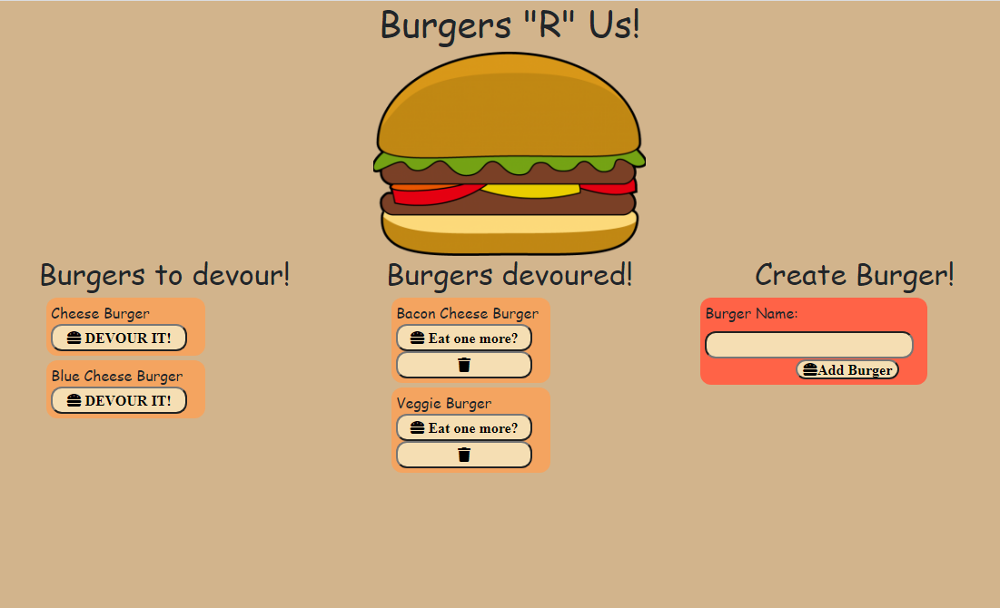

# Burgers "R" Us!

## Description
Burgers "R" Us is an application that allows the users to input a burger they would like to eat. Whenever the user creates a new burger it will be displayed on the left in the "Burgers to devour!" section. The user can move the burger to the "Burgers devoured!" section by clicking on the "Devour it!" button. If the user would like to eat another burger they can simply press "Eat one more?" button to move it back to the "Burgers to devour!" section. If the user would like to delete a burger, simply press the delete icon once the burger has been devoured.
        
## Table of Contents
- [Installation](#installation)

- [Usage](#usage)

- [License](#license)

- [Screenshot](#screenshot)

- [Test](#test)

- [Contributors](#contributors)

- [Questions](#questions)

    
## Installation
In order to use the application, the user must install express, express-hanldebars, and mysql.

## Usage
Click on the corresponding buttons to move the burger, if the user would like to create a burger, input a new burger and click the add burger button. To eat a burger, click on the devour it button, if the user would like to eat another burger click on the eat one more button otherwise to delete the burger click on the delete icon.
        
## License
This project uses MIT

## Screenshot

## Test
No tests are needed.

## Contributors
Jae Kim

## Questions
View my other projects!

https://github.com/JSK321

Have any questions?

Email me at: jaeshinkim321@gmail.com